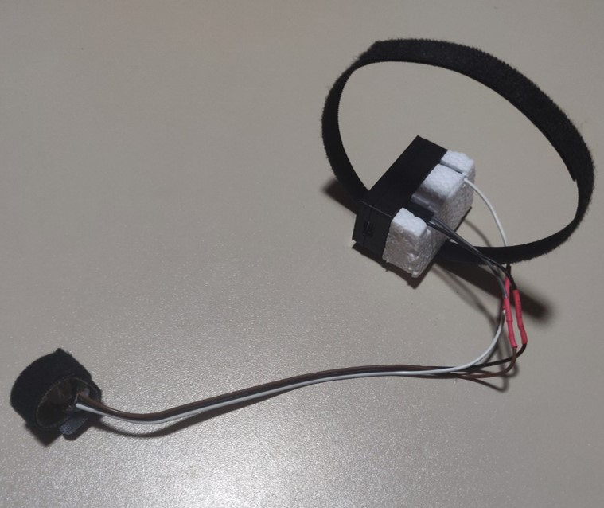

# Smart Alarm using Tiny Machine Learning

Smart Alarm using TinyML to take part in the **Call for TinyML edX Projects competition**, carried out by Harvard University.

## Table of contents

- [Purpose of the project](#Purpose-of-the-project)
- [Description of the project](#Description-of-the-project)
- [Constraints and challenges](#Constraints-and-challenges)
- [Expected due date](#Expected-due-date)
- [Authors](#Authors)
- [Final results](#Final-results)
- [User instructions](#User-instructions)
- [Future work](#Future-work)
- [Learning resources](#Learning-resources)
- [Disclaimer](#Disclaimer)
- [References](#References)

## Purpose of the project

The aim of this project is to develop an alarm system that adjusts the waking up time to the best moment based on data collected from different sensors.

A number of systems — for the time this project started — already employ Machine Learning (ML) to achieve this goal, but they depend on performing the calculations on external machines. These systems fall into two categories:

- Wearable devices equipped with different sensors that are directly attached to the user (i.e. wristband, smartwatch, rings...) which rely upon wireless communication (BLE, WIFI...) so as to transmit this information to another more powerful computer, typically a smartphone.
- A nightstand-style alarm clock that employs other different sensors which measure remotely the sleep cycles of the user.

While the former gives very reasonable results due to the fact that it has sensors that are in close contact with the body, it suffers from the drawback of a considerable battery drain. Not to mention the need for stable connectivity for data transmission. 

Conversely, the latter will not lead to any reliance upon a battery as a power supply. However, the quality of data seems to be more difficult to obtain and more sophisticated components are needed. As a result, these devices are priced much too high, becoming not very appealing to the 'common' user.

In light of the above, we propose a combination of the two above-mentioned systems into a feasible solution. In short, we aim to achieve accurate predictions while performing data analysis on a device powered by a battery without the need of a daily/weekly recharge. 

## Description of the project

The variable changes which take place while sleeping can be measured with different mechanisms. One of the most popular ones, Polysomnography (PSG), is the gold standard test for the study of sleep. However, albeit effective, this method is intrusive as well as unfeasible, since an entire specialized room equipped with sophisticated and expensive machines are required.

A more feasible approach is to try to reduce the number of components used in PSG to the bare minimum, in such a way that only the essential sensors are kept. Research suggests it is possible to achieve similar results to PSG [[1]](#1), [[2]](#2), [[3]](#3), [[4]](#4) only with a few sensors. In this project, we aim to build a system capable of obtaining such desired results with only accelerometer and heart rate sensors and with the help of Machine Learning. 

The main idea is to train a neural network model with data gathered from PSG for a **research project** [[5]](#5) and extract meaningful correlations among the sensor data. If with only accelerometer and heart rate data the model proves to distinguish specific patterns for different sleep stages, then it is possible to predict the state of sleep of a user on new fresh data.

For this project, we have devised a device attached to the body (e.g. a wristband) that intelligently adjusts the exact time to wake the user according to his state of sleep. The user will need to define a time threshold so that the model knows what is the range in which it has room to operate.

For example: the user wishes to wake up at around 8 am and it is okay if the system could trigger the alarm 15 minutes earlier or later. The user will then define a threshold of 30 minutes and the system will know that it can wake the user up at the most appropriate time between 7:45 and 8:15.

## Constraints and challenges 

A major challenge is to reduce the size of a trained ML model (to less than 1 MB of size) that still makes predictions with high accuracy, low latency and low power consumption.

Another challenge is to train a decent ML model with limited data, since the current data available do not come.

## Expected due date

31/08/2021

## Authors

Carlos Gil García, Daniel Moreno París

## Final results

The results of the application deployed on an Arduino Nano BLE Sense can be watched in the following [Youtube Video](https://www.youtube.com/watch?v=60zlHIsxDk4&t=2s&ab_channel=CarlosGil).

To conduct the experiments, we designed two different prototypes. One was built with a 3D printed case [[6]](#6) ([Prototype 1](#Prototype-1)) allowing easy connections with the Arduino pins and the other one was directed soldered on a perfboard ([Prototype 2](#Prototype-2)). In practice, there is no difference between both prototypes aside from the design, since both worked well in our experiments.

#### Prototype 1

Prototype 1 wristband attached |  Prototype 1 wristband
:-------------------------:|:-------------------------:
  |  

#### Prototype 2

Prototype 2 wristband attached |  Prototype 2 wristband
:-------------------------:|:-------------------------:
  |  

## User instructions

In this project, there are three major steps to follow: 

- Collect enough data to train a Machine Learning model: [Generate Dataset](src/colabs/generate_dataset/)
- Train and convert the model for deployment: [Model training](src/colabs/model_training/)
- Deploy the converted model onto the microcontroller: [Smart Alarm Application](src/arduino/smart_alarm/)

You must follow each of these steps in the same order to follow along with this project.

## Future work

Due to the limited time available for this competition, there are still pending tasks to be completed and considerations to be taken into account for future work. Some of these are listed below:

- Develop a mobile application (Android/IOS) connecting with the microcontroller via BLE. This might bring some potential benefits:
    * The microcontroller, which usually lacks Real Time Clocks (RTCs) — at least development boards, retrieves the local time from the phone's system internal clock.
    * The user can easily configure alarm settings, in a more user-friendly graphical user interface (GUI).
    * The user can choose to enable vibration, sound or both, as well as select different types of alarm sounds.
    * Statistical reports on the user's sleep information can be displayed and downloaded to the smartphone if desired.

    Note: for the implementation of a mobile application, the idea is that once the user closes the app, the microcontroller disables BLE advertising helping reduce battery drain.
    
- Gather more data from other resources [[7]](#7) to increase diversity and reduce overfitting.
- Other model architectures or type of machine learning techniques (e.g. Long short-term memory [[8]](#8) or Gradient Boosting Decision Tree Algorithm).
- Explore more ways of extracting representative features from the dataset. We used some tools to help us automate feature selection [[9]](#9), but there is room for better feature engineering.

## Learning resources

Apart from the outlined papers and articles used for research, our main learning sources for making this project possible have been the Tiny Machine Learning edX course [[10]](#10) and the TinyML book [[11]](#11).

## Disclaimer

For the time being, the main objective of this project is purely for research. All components listed here as well as code or documentation are prototype-wise and not meant to be commercialized.

It is also worth mentioning that the authors of the project are not experts in the field of sleep medicine, thus non-accurate use of terminology or information may be foreseen. Additionally, constructive feedback and suggestions for improvement will be always welcome.

## References

<a id="1">[1]</a>
Olivia Walch, Yitong Huang, Daniel Forger, Cathy Goldstein, 
Sleep stage prediction with raw acceleration and photoplethysmography heart rate data derived from a consumer wearable device. Oxford Academic. https://doi.org/10.1093/sleep/zsz180

<a id="2">[2]</a>
Katherine A. Kaplan, Jason Hirshman, Beatriz Hernandez, Marcia L. Stefanick, Andrew R. Hoffman, Susan Redline, Sonia Ancoli-Israel, Katie Stone, Leah Friedman, Jamie M. Zeitzer,
When a gold standard isn’t so golden: Lack of prediction of subjective sleep quality from sleep polysomnography.
ScienceDirect. https://doi.org/10.1016/j.biopsycho.2016.11.010.

<a id="3">[3]</a> 
Blood, Mary L., Sack, Robert L, Percy, David C, Pen, Julie C.
A Comparison of Sleep Detection by Wrist Actigraphy, Behavioral Response, and Polysomnography.
Oxford Academic. https://doi.org/10.1093/sleep/20.6.388.

<a id="4">[4]</a> 
RT Journal Article
Miguel Marino, Yi Li, Michael N. Rueschman, J. W. Winkelman, J. M. Ellenbogen, J. M. Solet, Hilary Dulin, Lisa F. Berkman, Orfeu M. Buxton.
Measuring Sleep: Accuracy, Sensitivity, and Specificity of Wrist Actigraphy Compared to Polysomnography
Oxford Academic. https://doi.org/10.5665/sleep.3142.

<a id="5">[5]</a> 
Walch, O. (2019). 
Motion and heart rate from a wrist-worn wearable and labeled sleep from polysomnography (version 1.0.0). 
PhysioNet. https://doi.org/10.13026/hmhs-py35.

<a id="6">[6]</a>
"Arduino Nano case with completely accessible pins" (c) by Nicolai Sp (@nspohrer), retrieved from https://www.thingiverse.com/thing:959057/files, used under Attribution-ShareAlike 3.0 Unported (https://creativecommons.org/licenses/by-sa/3.0/).

<a id="7">[7]</a>
"Multi-Ethnic Study of Atherosclerosis (MESA Sleep)". Sleepdata.org. https://sleepdata.org/datasets/mesa.

<a id="8">[8]</a>
J. Brownlee, "LSTMs for Human Activity Recognition Time Series Classification". Machine Learning Mastery. https://machinelearningmastery.com/how-to-develop-rnn-models-for-human-activity-recognition-time-series-classification/

<a id="9">[9]</a>
Horn, Franziska, Robert Pack, and Michael Rieger. "The autofeat python library for automated feature engineering and selection." arXiv preprint arXiv:1901.07329 (2019).

<a id="10">[10]</a>
The Future of ML is Tiny and Bright. edX.
https://www.edx.org/professional-certificate/harvardx-tiny-machine-learning

<a id="11">[11]</a>
Warden, Pete, and Daniel Situnayake. 
TinyML: Machine Learning with TENSORFLOW Lite on Arduino and Ultra-Low Power Microcontrollers. O'Reilly Media Inc., 2020.
