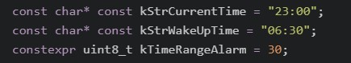
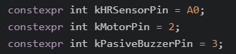

# Smart Alarm

You

## Brief description

## Detailed description

## Dependencies

Additional dependencies to install needed for this application to run.

#### Libraries

- Arduino_TensorFlowLite (Recommended version: 2.4.0-ALPHA).
- Arduino_LSM9DS1 (Recommended version: 1.1.0).

#### Boards (in the case of deploying to the Arduino BLE 33 Sense)

- Arduino MBED OS Nano Boards (Minimum version: 2.3.1). 

## Instructions

1. Open the Project in the Arduino IDE.
2. In `constants.h` modify `kStrCurrentTime`, `kStrWakeUpTime` and `kTimeRangeAlarm` to your own needs:

* kStrCurrentTime: Time in 24-hours format when you will go to bed. At this time, the Arduino has to be switched on.
* kStrWakeUpTime: Time in 24-hours format when you would ideally like to be awakened.
* kTimeRangeAlarm: Range of time in minutes (split into two halves) which the Arduino is allowed to trigger the alarm.

3. Install the dependencies listed in `Boards Manager` and `Library Manager` sections.
4. Select the correct board and port.
5. Compile and Upload to the device.
6. Once flashed, connect your components as shown in [Sketch of components and connections](#Sketch-of-components-and-connections).

**Note**: the device will start as soon as the Arduino has been powered on. It is important to synchronize this with the time defined in `kStrCurrentTime`.

## Sketch of components and connections

This sketch serves as an intuitive guide of how you should connect the components in order to make the system work as expected. Please note that your components might be different as the ones we used for our prototypes and you may need to make your own custom design.

If you connect the components to other analog/digital pins, you need to update these in `constants.h`, which are shown in the following picture:

Depending on your own liking, you can either connect the buzzer, the vibration motor or both together.

## Additional notes

Even though this first version of the Arduino application is enough to obtain the desired results, it is still far from complete. The major constraint is that it is bound to a specific set of rules in order to operate correctly. For future versions, stated in [Future work](../../../README.md#Future-work), we have devised some improvements so as to make it more flexible and user friendly. Most of which involve the incorporation of a mobile application (not developed yet) into the system, leveraging BLE connectivity.

These improvements will help, for instance, not having to connect the Arduino at the same time the user goes to sleep, configuring the Arduino directly from the app (i.e. time to wake up (`kStrWakeUpTime`) and range interval (`kTimeRangeAlarm`) and selecting which wake up mode to use (vibration/sound/both) without having to disconnect them physically.

