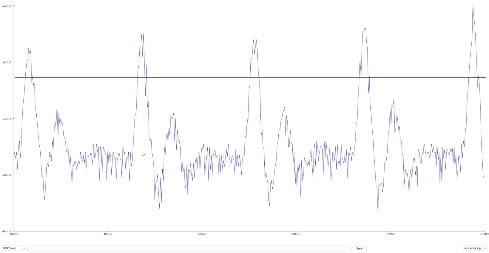

# Adjust Threshold.ino

This application is purely intended to assess the sensitivity of the heart rate sensor as explained in [Before you deploy](../../smart_alarm/README.md#Before-you-deploy).

## Instructions

1. Open the Project in the Arduino IDE.
2. Make sure you connect the sensor to the same analog pin as in the code.
3. Compile and Upload to the device.
4. Click on `Serial Plotter` under the Tools tab or press `Ctrl+Shift+L`.
5. With the sensor attached to your skin, wait a little bit until the Plotter gets stabilized and select an approximate threshold based on the waveform. See [Illustrative example](#Illustrative-example).

## Illustrative example

Each cardiac cycle is characterized by a total of 6 peaks, due to the rhythmic contraction and relaxation of the heart muscles. Out of these peaks, we are interested in detecting the so called *R-peak* values (produced by the ending of the atrial contraction), which is the highest peak of the signal. It is important to choose a threshold high enough so that it does not interfere with the other peaks. But this, in turn, should not be too high as it may skip some *R-peak* generating false measurements.

The following picture illustrates an example from our Serial Plotter, in which we can determine a threshold of approximately 535, indicated by the red line.

 
