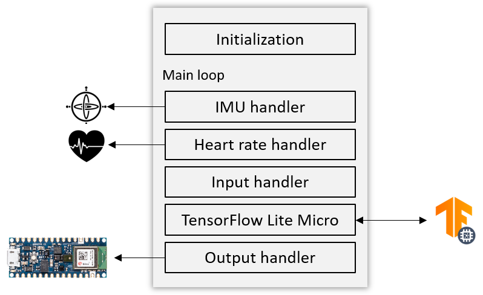
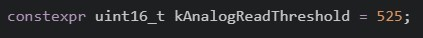
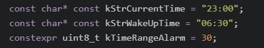
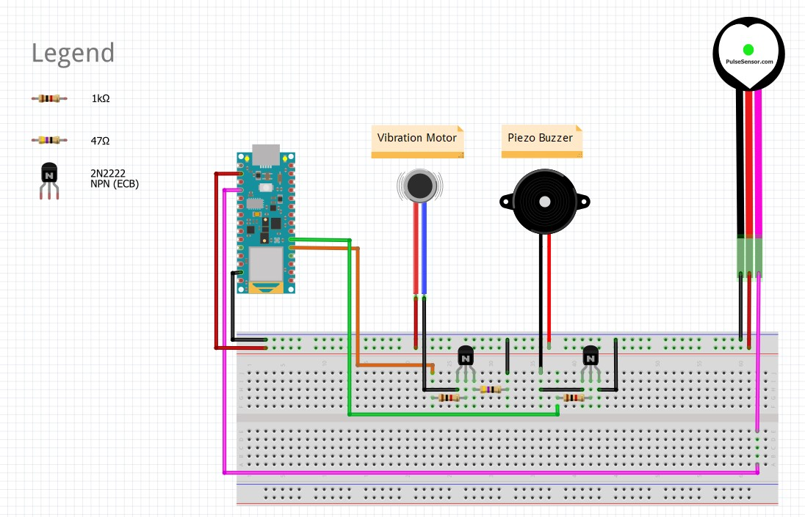
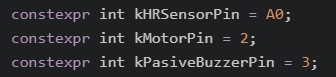

# Smart Alarm

## Table of contents

- [Smart Alarm application architecture](#Smart-Alarm-application-architecture)
- [Dependencies](#Dependencies)
- [Before you deploy](#Before-you-deploy)
- [Instructions](#Instructions)
- [Sketch of components and connections](#Sketch-of-components-and-connections)
- [Components used](#Components-used)
- [Additional notes](#Additional-notes)

## Smart Alarm application architecture

* Initialization: Declaring variables, instantiating objects, loading the model, resolving the operations, initializing the interpreter, allocating the Tensor Arena, defining model input parameters and setting up sensors and timers.
* IMU handler: It reads the accelerometer data from the IMU sensor.
* Heart rate handler: It reads the BPM data from the heart rate sensor.
* Input handler: It processes the data read by IMU Handler and heart rate Handler based on the dataset the model was trained on and feeds the processed data into the model.
* TensorFlow Lite Micro: Invoke interpreter and run inference.
* Output handler: It processes the output from the model, checks the result and triggers the alarm when commanded.

## Dependencies

Additional dependencies to install needed for this application to run.

### Libraries

- Arduino_TensorFlowLite (Recommended version: 2.4.0-ALPHA).
- Arduino_LSM9DS1 (Recommended version: 1.1.0).
- PulseSensor Playground (Recommended version: 1.6.0)

**Note**: For the time we are writing this, the latest official version of the PulseSensor Playground available in the Arduino IDE is the 1.5.1. In order for the Arduino Nano BLE Sense to work with this sensor, a version higher than 1.6.0 is required. For this, we needed to download it directly from the source code in their [GitHub](https://github.com/WorldFamousElectronics/PulseSensorPlayground) repository, and paste it when the other Arduino libraries are located (by default in `/Documents`).

### Boards (in the case of deploying to the Arduino BLE 33 Sense)

- Arduino MBED OS Nano Boards (Minimum version: 2.3.1). 

## Before you deploy

The sensitivity of the heart rate sensor [we chose for this project](#Before-you-deploy) may vary from one to another. One key variable for the application to read valid BPM is to adjust the threshold correctly. If you are using the same sensor as ours, it is important that you run [adjust_threshold.ino](../test_hr_sensor/adjust_threshold/adjust_threshold.ino) first, so that you can see which threshold your sensor needs specifically. 

Once you have the threslhold value, modify `kAnalogReadThreshold` in `constants.h`.

## Instructions

1. Make sure you read [Before you deploy](#Before-you-deploy) and follow the steps stated carefully.
2. Open the Project in the Arduino IDE.
3. In `constants.h` modify `kStrCurrentTime`, `kStrWakeUpTime` and `kTimeRangeAlarm` to your own needs:

    

    * kStrCurrentTime: Time in 24-hours format when you will go to bed. At this time, the Arduino has to be switched on.
    * kStrWakeUpTime: Time in 24-hours format when you would ideally like to be awakened.
    * kTimeRangeAlarm: Range of time in minutes (split into two halves) which the Arduino is allowed to trigger the alarm.

4. Copy and paste the `.txt` files generated in [tflite_model_training_DNN.ipynb](../../colabs/model_training/tflite_model_training_DNN.ipynb) under the `/mcu` directory generated in the Colab.

    * Copy the array saved in `normalization_ranges.txt` and paste it to the array `kNormalizationRanges` in `constants.h`.
    * Copy the array saved in `smart_alarm_model.txt` and paste it to `smart_alarm_model` in `model.h`.

5. Install the dependencies listed in `Boards Manager` and `Library Manager` sections.
6. Select the correct board and port.
7. Compile and Upload to the device.
8. Once flashed, connect your components as shown in [Sketch of components and connections](#Sketch-of-components-and-connections).

**Note**: the device will start as soon as the Arduino has been powered on. It is important to synchronize this with the time defined in `kStrCurrentTime`.

## Sketch of components and connections

This sketch serves as an intuitive guide of how you should connect the components in order to make the system work as expected. Please note that your components might be different as the ones we used for our prototypes and you may need to make your own custom design.

If you connect the components to other analog/digital pins, you need to update these in `constants.h`, which are shown in the following picture:

Depending on your own liking, you can either connect the buzzer, the vibration motor or both together.

## Components used

For our prototype we have chosen the components listed below: 

* [Arduino Nano 33 BLE Sense](https://store-usa.arduino.cc/products/arduino-nano-33-ble-sense)
* [Heart Rate Sensor](https://pulsesensor.com/)
* [Vibration motor](https://www.adafruit.com/product/1201)
* [Piezo Buzzer](https://www.adafruit.com/product/1536)
* 2 resistors of 1KΩ and 1 resistor of 47Ω
* 2 NPN transistors (2N2222 or similar)

Note: The 5V buzzer sounds loud enough for an alarm under the 3.3V delivered by the microcontroller. You can supply it 5V for a louder sound with the Arduino Nano BLE Sense board by following this [link](https://support.arduino.cc/hc/en-us/articles/360014779679-Why-doesn-t-the-5V-pin-work-in-the-Arduino-Nano-33-BLE-boards-).

Note that you can use other components for your own application, but bear in mind that using different components from different manufacturers and with specifications will lead you to adapting the design as well as modifying the code. For example, if you decide to use another Arduino board (e.g. Arduino Nano Every), you will need to buy a separate IMU sensor and write the proper code for it. Because of this, we recommend you use the same components as ours.

## Additional notes

Even though this first version of the Arduino application is enough to obtain the desired results, it is still far from complete. The major constraint is that it is bound to a specific set of rules in order to operate correctly. For future versions, stated in [Future work](../../../README.md#Future-work), we have devised some improvements so as to make it more flexible and user friendly. Most of which involve the incorporation of a mobile application (not developed yet) into the system, leveraging BLE connectivity.

These improvements will help, for instance, not having to connect the Arduino at the same time the user goes to sleep, configuring the Arduino directly from the app (i.e. time to wake up (`kStrWakeUpTime`) and range interval (`kTimeRangeAlarm`) and selecting which wake up mode to use (vibration/sound/both) without having to disconnect them physically.
