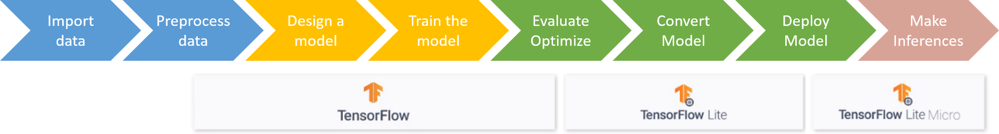

# TFLite Model Training Colab

Once the dataset has been generated in [generate_dataset.ipynb](../generate_dataset/generate_dataset.ipynb), it is ready for building our TinyML application. 

This Colab creates an end-to-end multi-class classifier for microcontrollers using the Tensorflow framework for training a neural network and TensorFlow Lite to convert it into a suitable format.

Therefore, this file comprises all the stages of the Tiny Machine Learning pipeline workflow, from importing the dataset all the way down to model deployment — the last step of making inferences is left to the Arduino.

## Table of contents

## Model used for this project

From our experiments, the model that has worked the best for our application and the processed dataset has been a Deep Neural Network (DNN). That is not to say, that other types of models might not provide better results with proper hyperparameter fine-tuning and careful preparation of the dataset. In fact, we tried other approaches which gave us positve results as well. The most noticeable ones were Long short-term memory (LSTM), which is a type of recurrent neural network (RNN), and the Gradient Boosting Decision Tree Algorithm, which is a more standard Machine Learning techniwqe. However, we decided to adhere to a DNN as the most promising model for the time being, leaving a more comprehensive model study for future work.

## Steps

## Running the program on Colab

Upload `tflite_model_training_DNN.ipynb` to your Google Drive and open it from the web-browser within the Google Drive page. 

Once you've opened the file, to generate your custom dataset out of the original one, simply run all the cells in this Colab. You do this by clicking the `run all` option in the Runtime tab or pressing `Ctrl+F9`.

## Running the program on Colab

To run the program locally in a Jupyter Notebook, you need to connect Google Colab to a Local Jupyter Runtime. To do this, please go to this [tutorial](https://research.google.com/colaboratory/local-runtimes.html "Google Colaboratory") which explains thoroughly how to set it up. 

Once that's done, just click `run all` under the `Cell` tab.
