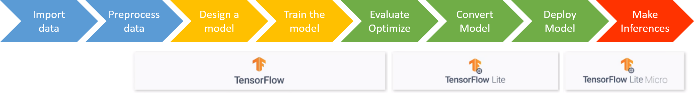

# TFLite Model Training Colab

Once the dataset has been generated in [generate_dataset.ipynb](../generate_dataset/generate_dataset.ipynb), it is ready for building our TinyML application. 

This Colab creates an end-to-end multi-class classifier for microcontrollers using the Tensorflow framework for training a neural network and TensorFlow Lite to convert it into a suitable format.

Therefore, this file comprises all the stages of the typical Tiny Machine Learning pipeline workflow, from importing the dataset all the way down to model deployment — the last step of making inferences is left to the Arduino. See [Steps followed in this Colab](#Steps-followed-in-this-Colab).

## Table of contents

- [Steps followed in this Colab](#Steps-followed-in-this-Colab)
- [Model used for this project](#Model-used-for-this-project)
- [Running the program on Colab](#Running-the-program-on-Colab)
- [Running the program on Jupyter Notebook](#Running-the-program-on-Jupyter-Notebook)

## Steps followed in this Colab

The steps taken in this Colab follow the TinyML pipeline workflow:

* Import the dataset.
* Preprocess the dataset: extract significant features which provide the highest value for learning and prepare it for input into the neural network.
* Design and build a model. See [Model used for this project](#Model-used-for-this-project).
* Train the model.
* Evaluate and optimize.
* Convert the model for deployment: applying optimization and quantization to reduce the model's size while still keeping good accuracy.
* Save the model converted.

## Model used for this project

From our experiments, the model that worked the best for our application and the processed dataset was a Deep Neural Network (DNN). That is not to say that other types of models might not provide better results with proper hyperparameter fine-tuning and careful preparation of the dataset. In fact, we tried other approaches which gave us positive results as well. The most notable ones were Long short-term memory (LSTM), which is a type of recurrent neural network (RNN), and the Gradient Boosting Decision Tree Algorithm, which is a more standard Machine Learning technique. However, we decided to adhere to a DNN as the most promising model for the time being, leaving a more comprehensive study of the model for [Future work](../../../README.md#Future-work).

## Running the program on Colab

Upload `tflite_model_training_DNN.ipynb` to your Google Drive and open it from the web-browser within the Google Drive page. 

Once you've opened the file, to generate your custom dataset out of the original one, simply run all the cells in this Colab. You do this by clicking the `run all` option in the Runtime tab or pressing `Ctrl+F9`.

## Running the program on Colab

To run the program locally in a Jupyter Notebook, you need to connect Google Colab to a Local Jupyter Runtime. To do this, please go to this [tutorial](https://research.google.com/colaboratory/local-runtimes.html "Google Colaboratory") which explains thoroughly how to set it up. 

Once that's done, just click `run all` under the `Cell` tab.
